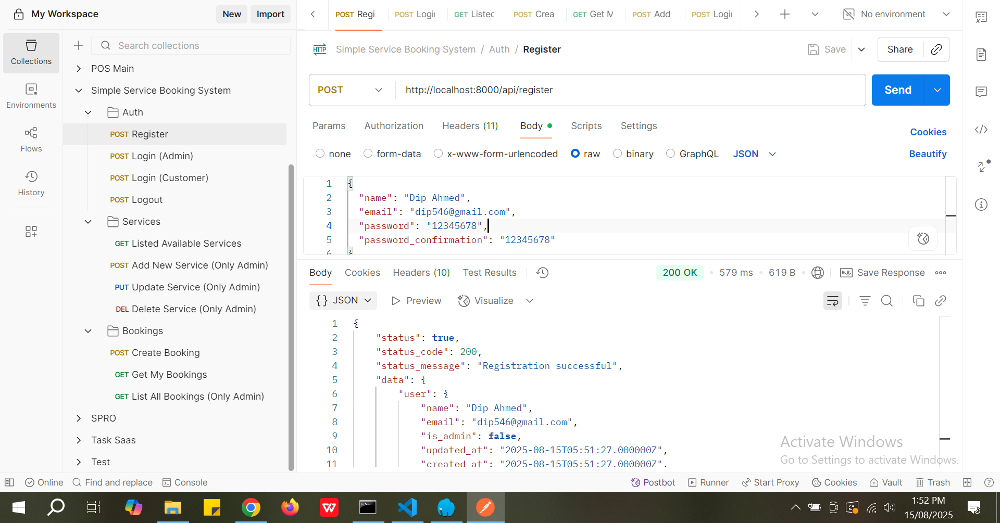
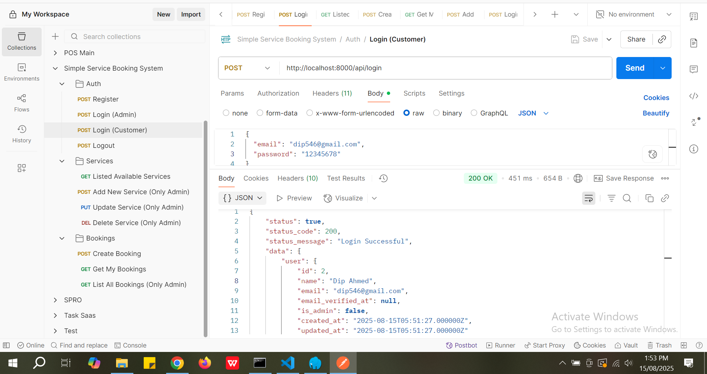
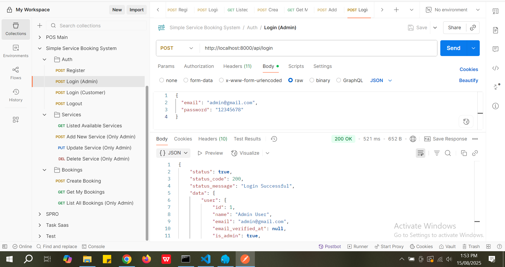
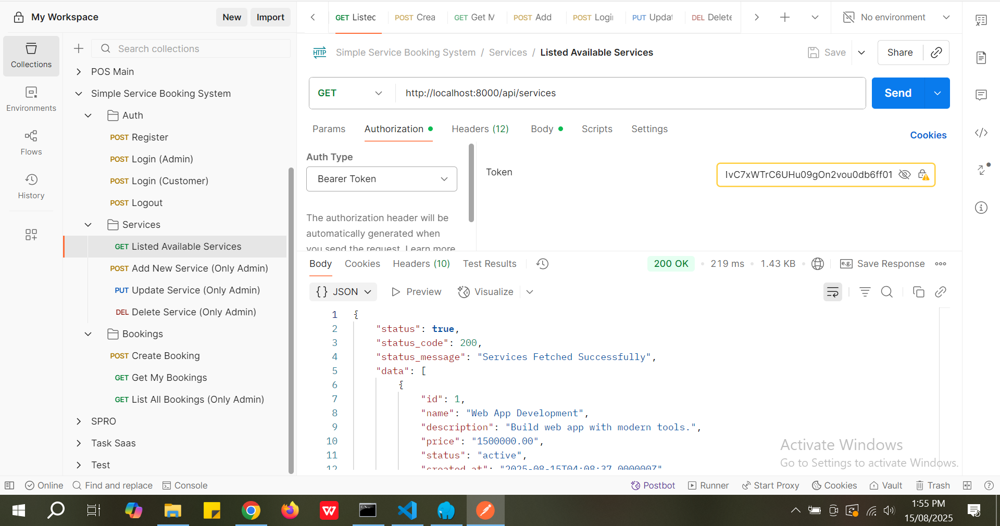
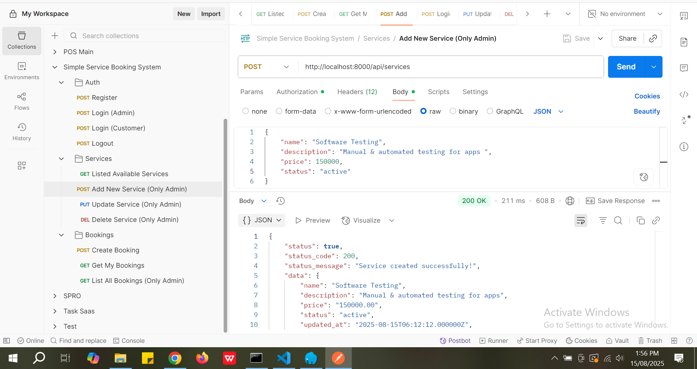
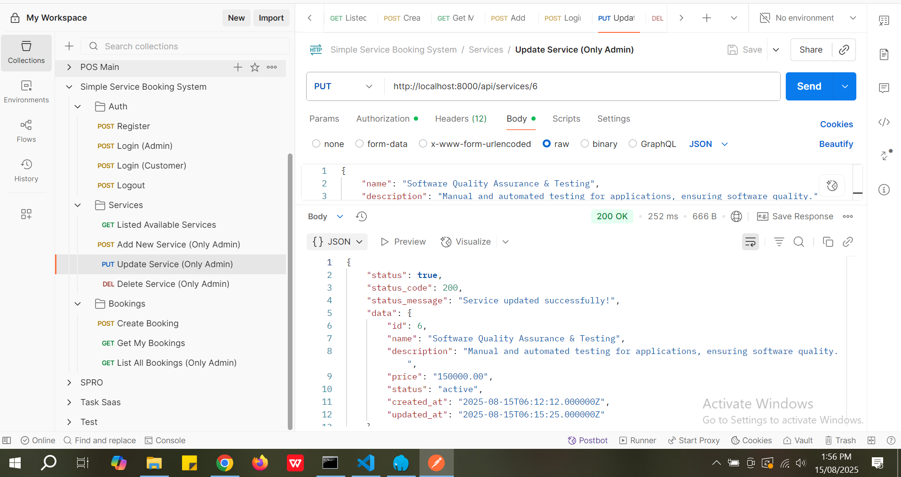
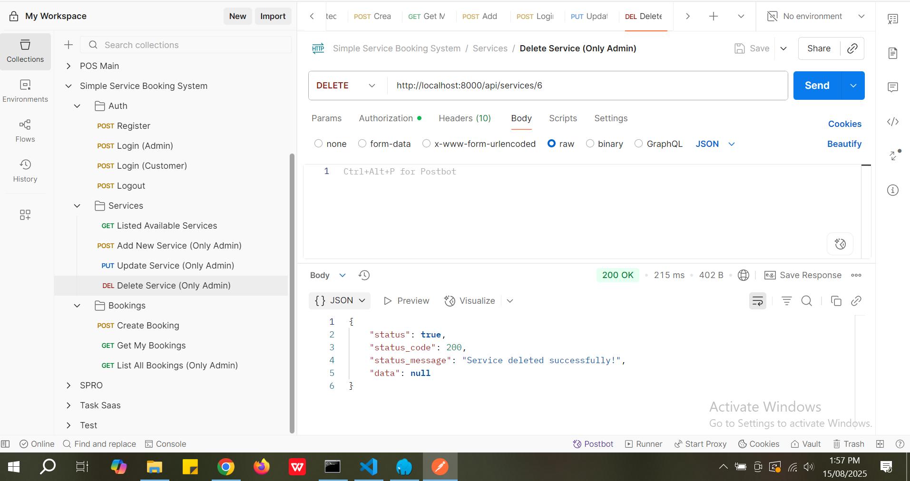
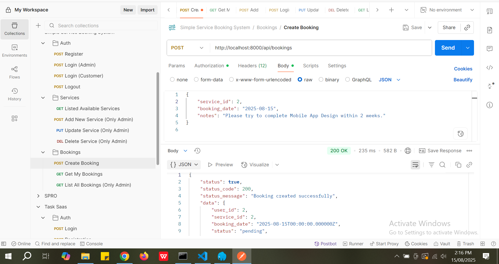
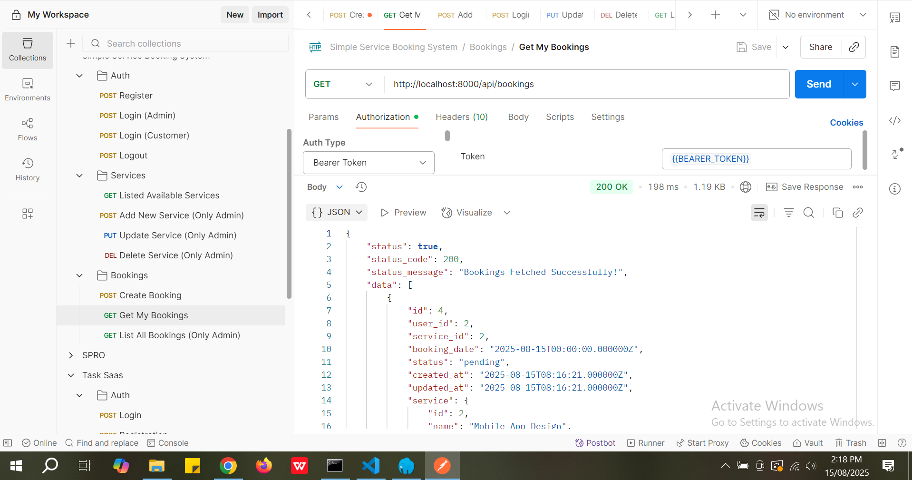
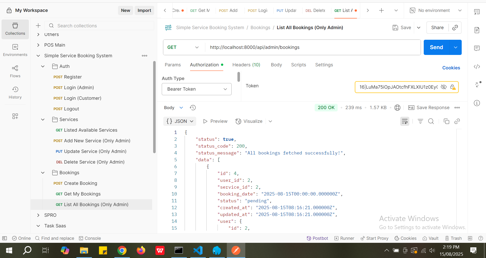

# Simple Service Booking System

A simple service booking API built with **Laravel 10**, **PHP 8.1+**, and **Laravel Sanctum** for authentication.

---

## 🚀 Requirements

* PHP **^8.1**
* Composer
* MySQL
* Laravel **^10.10**
* Laravel Sanctum **^3.3**

---

## 📦 Installation & Setup

### 1️⃣ Clone the Repository

```bash
git clone https://github.com/AhmedDip/simple-service-booking-system-api.git
cd simple-service-booking-system-api
```

### 2️⃣ Install Dependencies

```bash
composer install
```

### 3️⃣ Copy Environment File & Generate App Key

```bash
cp .env.example .env
php artisan key:generate
```

### 4️⃣ Configure `.env`

Update database credentials:

```env
DB_CONNECTION=mysql
DB_HOST=127.0.0.1
DB_PORT=3306
DB_DATABASE=your_database_name
DB_USERNAME=your_db_user
DB_PASSWORD=your_db_password
```

### 5️⃣ Run Migrations & Seeders

```bash
php artisan migrate
php artisan db:seed
```

### 6️⃣ Start Development Server

```bash
php artisan serve
```

App will be available at: **[http://localhost:8000](http://localhost:8000)**

---

## 🔑 Authentication & Token Usage

### Login Flow

1. **Login** using:

   ```
   POST /api/login
   ```
2. The response will include a **token**.
3. Use the token in the **Authorization** header as:

   ```
   Authorization: Bearer <your_token_here>
   ```

### Postman Setup

1. Go to the **Authorization** tab.
2. Set **Type** to `Bearer Token`.
3. Paste your token.

---

## 📚 API Endpoints

### **Auth**

| Method | Endpoint        | Description   | Auth Required |
| ------ | --------------- | ------------- | ------------- |
| POST   | `/api/login`    | Login user    | NO            |
| POST   | `/api/register` | Register user | NO            |
| POST   | `/api/logout`   | Logout user   | YES           |

### **Services**

| Method | Endpoint             | Description             | Role  |
| ------ | -------------------- | ----------------------- | ----- |
| GET    | `/api/services`      | List available services | Any   |
| POST   | `/api/services`      | Create service          | Admin |
| PUT    | `/api/services/{id}` | Update service          | Admin |
| DELETE | `/api/services/{id}` | Delete service          | Admin |

### **Bookings**

| Method | Endpoint              | Description       | Role               |
| ------ | --------------------- | ----------------- | ------------------ |
| POST   | `/api/bookings`       | Create booking    | Authenticated user |
| GET    | `/api/bookings`       | Get my bookings   | Authenticated user |
| GET    | `/api/admin/bookings` | List all bookings | Admin              |

---

## 🧪 Running Tests

Run all tests:

```bash
php artisan test
```


---

## 🖼 Screenshots

| Feature                   | Screenshot                                      |
| ------------------------- | ----------------------------------------------- |
| Register                  |        |
| Login (Customer)          |  |
| Login (Admin)             |     |
| Logout                    |          |
| List Available Services   |    |
| Create Service (Admin)    |             |
| Update Service (Admin)    |             |
| Delete Service (Admin)    |             |
| Create Booking            |             |
| Get My Bookings           |           |
| List All Bookings (Admin) |             |

---
